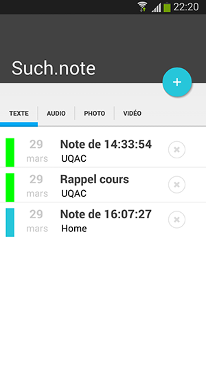
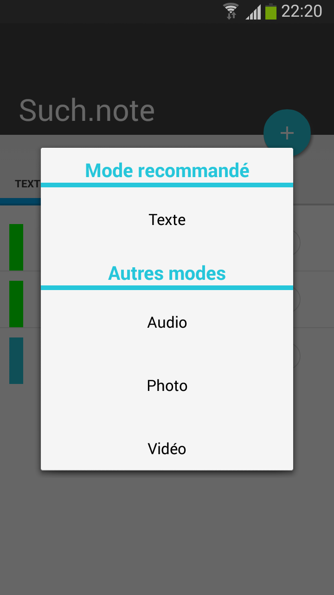
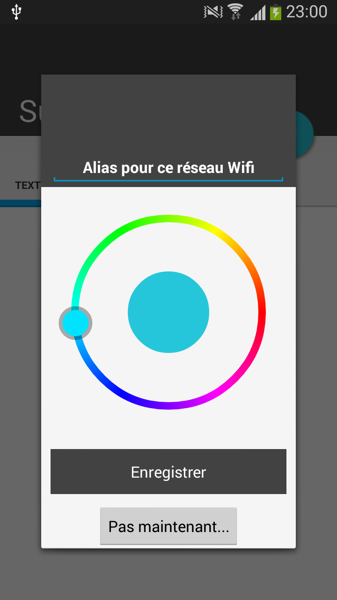

# SuchNote

Projet UQAC de création d'une application de prise de notes.

<h4> Cette application permet : </h4>

- de prendre des notes de manière rapide et efficace, selon le contexte dans lequel on se trouve.

- de choisir parmi 4 types de notes : Texte, Audio, Photo et Vidéo. En fonction des capteurs de l'appareil, un type de note est conseillé, mais les autres types restent accessibles. La raison de ce choix est simple : l'informatique ubiquitaire est un outil important, mais l'utilisateur doit avoir le dernier mot !

- Nommer les notes de manière automatique, en cliquant sur l'icône à droite du champs de saisie. On gagne du temps, et on reste cohérent vis-à-vis des types de notes (aucun de texte à saisir).

- au démarrage de l'application, si le réseau Wifi (auquel l'appareil est connecté) est inconnu, une fenêtre permet à l'utilisateur d'enregistrer ce réseau (choix d'un alias et d'une couleur). Cette information est ensuite associée à toutes les notes enregistrées en étant connecté à ce réseau.

- Les notes sont affichées sur la page principale de l'application. Afin de permettre à l'utilisateur de s'y retrouver, elles sont triées par catégories. Le code couleur permet d'associer rapidement une note à son contexte. Par exemple, la couleur verte pour les notes prises à l'UQAC (comprendre "en étant connecté au réseau Wifi de l'UQAC").

- Les notes sont sauvegardés sur l'appareil (sur le stockage externe), mais les informations relatives aux notes (date, réseau associé, etc.) sont stockées dans une base de données SQLite propre à l'application. La base de données sert également à stocker les informations relatives aux réseaux enregistrés (SSID, alias, couleur associée). 

- L'application dispose de son propre "lecteur" de notes. En fonction du type de note, un fragment permet de lire/écouter/voir le contenu de la note sans quitter l'application.

- L'application utilise le contexte pour donner un score à chaque type de note (au moment où l'utilisateur lance le processus de création d'une note). Le type ayant le score le plus élevé est mis en avant.

- Les capteurs utilisés sont : la luminosité (photo et vidéo déconseillées en cas de luminosité trop faible), la vitesse de déplacement (pas de texte, de photo ou de vidéo si l'on conduit) et le niveau audio de l'appareil (si les sons "MEDIA" et "SONNERIE" sont à 0, on déconseille les notes "audio" en supposant que l'utilisateur souhaite rester silencieux).

- Il est possible d'ajouter facilement de nouveaux capteurs et de les intégrer au calcul des scores. L'application a été pensée afin de permettre facilement ce genre d'évolutions.

- On peut supprimer les notes directement depuis l'application, et c'est le seule moyen stable de le faire ! En effet, l'application supprime le fichier ET met à jour la base de données interne.

<h4> Pour aller plus loin (ce que nous aurions aimé ajouter) : </h4>

- Ajouter de nouveaux capteurs : analyse du contenu pour un éventuel cryptage, localisation GPS pour mettre un "tag" sur les notes, utiliser l'accéléromètre pour déconseillé certains modes, écouter le bruit ambiant pour déconseiller (éventuellement) le mode audio en cas de fort bruit, etc.

- Ajouter un système de tri des notes : pouvoir trier ses notes en fonction du contexte (contexte enregistré lors de la prise ET contexte actuel : par exemple, mettre en avant les notes de travail QUAND je suis au travail).

- Gérer la sauvegarde des notes dans le Cloud.

- Gérer l'export et l'import de notes via un fichier.

- Gestion des paramètres via un fragment dédié (préférences utilisateurs, gestion des réseaux enregistrés, etc.)

- Stabiliser la gestion de la mémoire ; en cas d'utilisation intensive, il arrive que les appareils peu puissants arrivent à court de mémoire.

